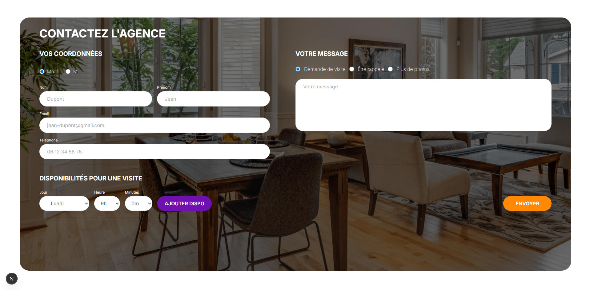
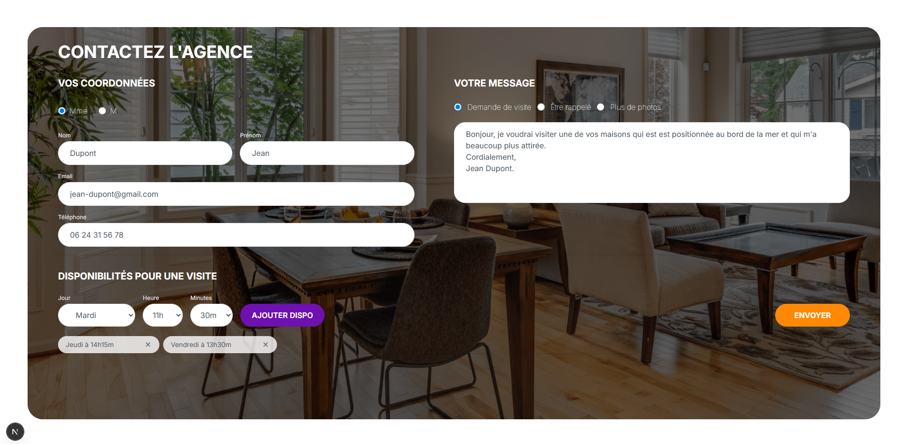
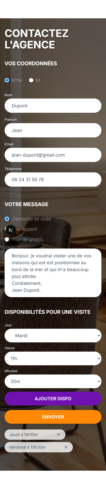
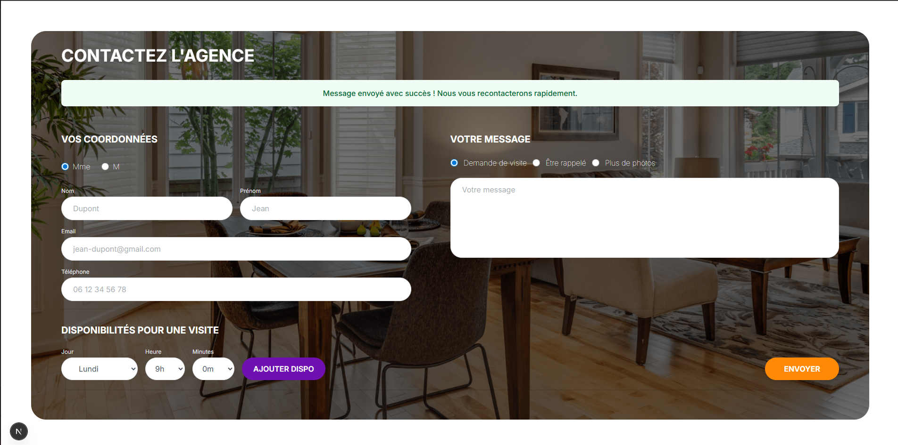
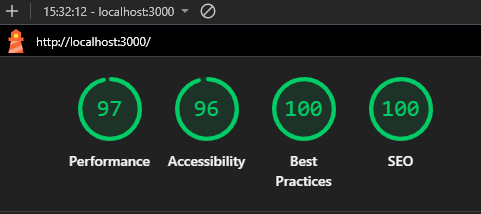

# 🏠 Test Tremplin — Majordhom

Formulaire de contact interactif pour l'agence Majordhom, développé avec **Next.js 14**, **Prisma** et **Tailwind CSS**.

---

## 👤 À propos de moi

| Informations | Détails |
|---|---|
| **Nom / Prénom** | Anchoura Abdou Mchinda |
| **Formation** | Développeur Web & Web Mobile — Garage404 Saint-Étienne |
| **Niveau** | Bac+2 (RNCP Niveau 5) en cours |
| **Stage souhaité** | 2 mois dès Septembre |
| **LinkedIn** | [linkedin.com/in/anchoura-abdou](https://linkedin.com) |
| **GitHub** | [github.com/anch365](https://github.com/anch365) |

---

## 📸 Captures d'écran

### Page principale



### Formulaire rempli

#### Desktop



#### Mobile



### Validation et succès



---

## 🛠️ Stack technique & choix

### Framework

| Technologie | Version | Choix |
|---|---|---|
| **Next.js** | 16.2.9 | Framework React moderne avec App Router, Server Actions, et rendu hybride. Permet de développer frontend ET backend (API, DB) dans le même projet. |
| **TypeScript** | 5+ (via Next) | Typage statique qui prévient les bugs à la compilation, auto-complétion dans l'IDE, code auto-documenté. |

### Base de données & ORM

| Technologie | Version | Choix |
|---|---|---|
| **Prisma** | 6.19.3 | ORM moderne pour interagir avec la DB en TypeScript pur. Génère un client type-safe, migrations automatiques, schéma déclaratif. |
| **MySQL** | 8.4 | Base de données récupéré du docker compose présent dans le dossier du test. |

### Styling & UI

| Technologie | Version | Choix |
|---|---|---|
| **Tailwind CSS** | 4.x | Framework CSS utilitaire. Permet de styliser rapidement sans quitter le HTML, responsive par défaut, bundle optimisé (purge des classes inutilisées). |
| **Inter (Google Fonts)** | via `next/font` | Police moderne et lisible, chargée de manière optimisée par Next.js (pas de flash de texte invisible). |

### Validation

| Technologie | Version | Choix |
|---|---|---|
| **Zod** | 4.x | Librairie de validation déclarative. Définit un schéma (=règles) et valide automatiquement les données. Intégration TypeScript parfaite (inférence des types). |

### Architecture

| Concept | Explication |
|---|---|
| **App Router** | Système de routing basé sur les dossiers. Chaque `page.tsx` = une route. |
| **Server Components** | Composants rendus sur le serveur (par défaut dans Next.js App Router). Plus rapides, plus sécurisés. |
| **Client Components** | Composants avec `"use client"` rendus dans le navigateur. Nécessaires pour l'interactivité (formulaires). |
| **Server Actions** | Fonctions qui s'exécutent sur le serveur mais s'appellent depuis le navigateur. Éliminent le besoin d'une API REST pour les formulaires. |

---

## 🚀 Lancement du projet

### Prérequis

- **Node.js** v20.9+

- **Docker Desktop** (pour la base de données)

- **npm**

### Installation

```bash

# 1. Cloner le dépôt
git clone https://github.com/anch365/test-tremplin-majordhom.git
cd test-tremplin-majordhom

# 2. Installer les dépendances
npm install

# 3. Copier le fichier d'environnement
cp .env.example .env

# 3.bis remplir le .env avec vos données

# (ou crée .env avec : DATABASE_URL="postgresql://...")

# 4. Démarrer Docker (base de données)
docker compose up -d

# 5. Générer le client Prisma et créer les tables
npm run db:push

# 6. Lancer le serveur de développement
npm run dev
```

### Accéder à l'application

Ouvre [http://localhost:3000](http://localhost:3000) dans ton navigateur.

### Voir les données enregistrées

```bash
npm run db:studio
```

Ouvre Prisma Studio à [http://localhost:5555](http://localhost:5555) pour voir/modifier les données de la base.

### Scripts disponibles

| Commande | Description |
|---|---|
| `npm run dev` | Lance le serveur de développement |
| `npm run build` | Compile l'application pour la production |
| `npm start` | Lance l'application en mode production |
| `npm run db:push` | Synchronise le schéma Prisma avec la DB |
| `npm run db:studio` | Ouvre l'interface d'administration de la DB |

---

## ❓ Questions

### 1. Avez-vous trouvé l'exercice facile ou difficile ? Qu'est-ce qui vous a posé problème ?

L'exercice était **accessible** pour quelqu'un qui maîtrise les bases de React et Next.js. La partie la plus intéressante était l'intégration de **Prisma** pour la persistance des données, car il fallait bien comprendre le flux : formulaire → Server Action → validation → base de données → réponse.

Le principal défi a été de gérer les **disponibilités dynamiques** (ajouter/supprimer des créneaux) et de structurer le code de manière propre et réutilisable avec les sous-composants.

### 2. Avez-vous appris de nouveaux outils pour répondre à l'exercice ? Si oui, lesquels ?

Oui ! J'ai découvert **Prisma** pour la gestion de base de données — un outil qui simplifie énormément les interactions avec la DB grâce à son client type-safe. J'ai également approfondi les **Server Actions** de Next.js 14 qui permettent de soumettre un formulaire sans avoir à créer une API REST séparée.

J'ai aussi utilisé **Zod** pour la validation côté serveur — une librairie très pratique qui fonctionne parfaitement avec TypeScript.

### 3. Quelle est la place du développement web dans votre cursus de formation ?

Je suis actuellement en formation **Développeur Web et Web Mobile** à **Garage404 Saint-Étienne** (RNCP niveau 5 - Bac+2). Le développement web est le **cœur** de ma formation : nous apprenons à créer des applications web complètes, du frontend (HTML/CSS, JavaScript, React) au backend (PHP, Node.js, Symfony).

L'objectif est de maîtriser l'ensemble de la chaîne de développement pour devenir développeur fullstack. Ce test technique est exactement le type de projet qui correspond à ce que j'apprends en formation.

### 4. Avez-vous utilisé un LLM ? Si oui, comment intégrez-vous les LLM à chaque étape de votre workflow ?

Oui, j'ai utilisé un **assistant IA (LLM)** comme outil d'apprentissage et d'accélération du développement. Voici comment je l'intègre :

- **Planification** : L'IA m'a aidé à structurer l'architecture du projet et à comprendre les concepts clés (Server Actions, Prisma ORM).
- **Apprentissage** : J'ai demandé des explications détaillées sur Next.js et Prisma avant de coder, ce qui m'a permis de comprendre le *pourquoi* derrière chaque choix technique.
- **Débogage** : Quand le build échouait (TypeScript strict, Zod v4, CSS), l'IA m'a aidé à identifier et corriger rapidement les erreurs.
- **Documentation** : L'IA a généré les commentaires de code détaillés et le README.

**Ma philosophie** : L'IA n'écrit pas le code à ma place — elle m'explique les concepts, me suggère des patterns, et m'aide à comprendre les erreurs. C'est un **outil d'apprentissage** et d'accélération, pas un substitut à la compréhension.

---

## 📋 Accessibilité & Audit Lighthouse

### Décision d'adaptation par rapport à la maquette

Lors de l'intégration de la maquette, j'ai pris la décision **consciente** de m'écarter légèrement du design original sur un point crucial : **l'accessibilité**.

Dans la maquette d'origine, certains champs de formulaire (`<input>`, `<select>`) ne possédaient pas de label associé (via l'attribut `for` du label qui est relié à un attribut `id` d'un input ou d'un select), ce qui baissait la note `Accessiilité` de l'audit Lighthouse.

J'ai donc **ajouté ces attributs** pour garantir :

- ✅ Une navigation au clavier fluide (Tab, Enter)
- ✅ Une compatibilité avec les lecteurs d'écran (aria-label, htmlFor)
- ✅ Une meilleure expérience pour tous les utilisateurs

### Résultat de l'audit Lighthouse



---

## 📝 Fonctionnalités

- ✅ Formulaire de contact complet (coordonnées + message + options)
- ✅ Ajout/suppression dynamique de disponibilités
- ✅ Validation des données côté serveur (Zod)
- ✅ Sauvegarde en base MySQL via Prisma
- ✅ Interface responsive (mobile, tablette, desktop)
- ✅ Feedback utilisateur (succès/erreur)
- ✅ Accessibilité (labels)

---

*Projet réalisé dans le cadre du test technique pour Majordhom — Marseille*